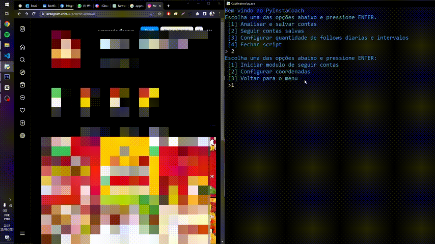

<h1 align="center"></h1>

Esse script tem como objetivo ajudar na análise de contas no Instagram, facilitando a criação de um banco de contas com maior probabilidade de engajamento e permitindo seguir, visualizar stories e curtir publicações automaticamente.

## Funcionalidades 🛠️

-   Captura de posições e imagens da tela para criar um arquivo de configuração
-   Auxílio na análise de contas para criar um banco de contas com maior probabilidade de engajamento
-   Segue contas automaticamente de acordo com o que foi definido nos arquivos de configuração
-   Visualiza stories automaticamente de acordo com o que foi definido nos arquivos de configuração
-   Curte publicações automaticamente de acordo com o que foi definido nos arquivos de configuração

## Tecnologias utilizadas 🚀

-   Python 3.6+ 🐍
-   PyAutoGUI 🖱️

## Como usar 🤔

1.  Clone o repositório: `git clone https://github.com/Moscarde/PyInstaCoach.git`
2.  Instale as dependências: `pip install -r requirements.txt`
3.  Execute o script: `python main.py`
4.  Escolha uma opção e siga os passos


## Arquivos de configuração 📝

Os arquivos de configurações são `follow_coordinates.json`, `analyze_coordinates.json` `parameters.json` que contém as seguintes informações:

```
{
    "URL": [412, 58],
    "Follow Btn": [657, 131],
    "Profile Picture": [277, 222],
    "Head End": [536, 356]
}
```

```
{
    "Minimum follows per day": 5,
    "Maximum follows per day": 10,
    "Minimum time between follows": 25,
    "Maximum time between follows": 40,
    "Watch stories": 1
}
```

As configurações do arquivo podem ser ajustadas de acordo com as necessidades do usuário diretamente no .json ou pelo main.py

## Prints e GIFs 📸🎥


## Limitações ⚠️

O uso desse script pode violar os termos de serviço do Instagram e resultar no bloqueio da conta. O uso é de responsabilidade do usuário.

## Conclusão 📝

Esse script pode ser uma ferramenta útil para ajudar na análise de contas no Instagram e aumentar o engajamento do perfil. É importante lembrar que o uso é de responsabilidade do usuário e que o script pode violar os termos de serviço do Instagram.
